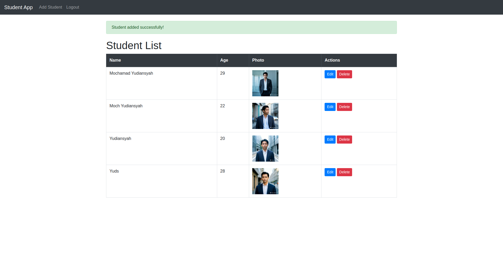
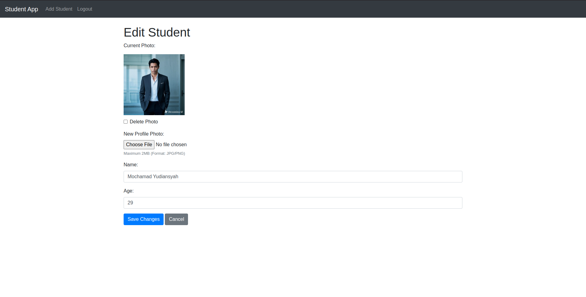
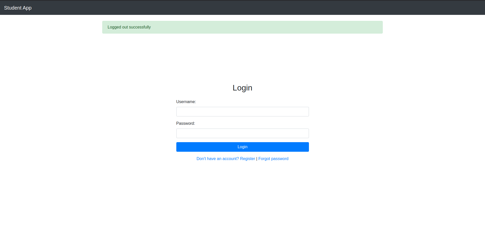
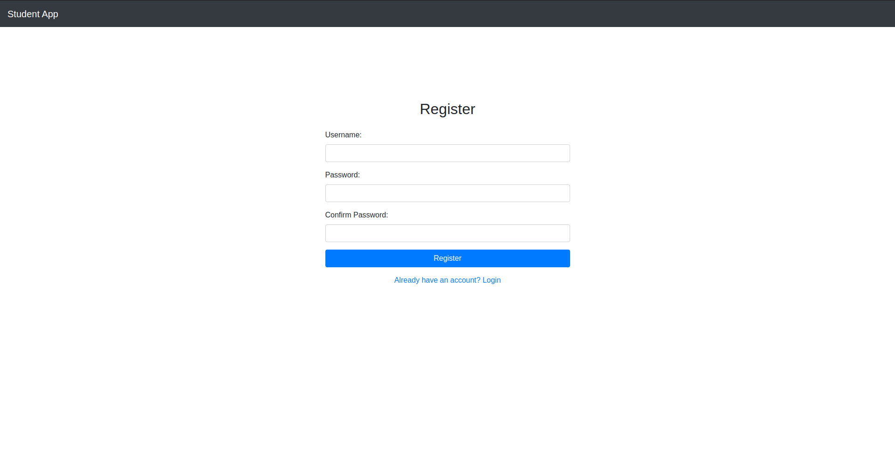
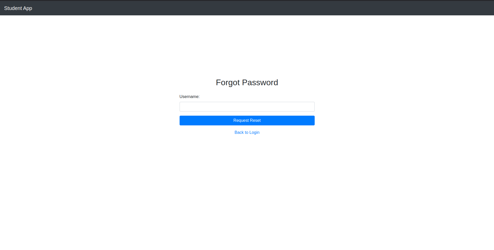

# Flask Student Management Application

This is a basic web application built with Flask, designed to manage a list of students. It allows you to add, update, and delete student records, including their name, age, and photo. The application also includes user authentication with registration, login, logout, and password reset functionalities.

## Screenshoot






## Features

-   **Student Management:**
    -   Add new student records, including their name, age, and profile photo.
    -   View a list of all students.
    -   Update existing student information.
    -   Delete student records.
-   **User Authentication:**
    -   User registration.
    -   Secure user login.
    -   User logout.
    -   Password reset functionality via a reset token.
-   **Photo Uploads:**
    -   Upload profile photos for students (JPG/JPEG/PNG formats supported, maximum size 2MB).
-   **Database:**
    - Uses SQLite for data storage.
-   **Security:**
    - CSRF protection is implemented for forms.
    - Password hashing is used for user security.

## Prerequisites

-   Python 3.6+
-   pip (Python package manager)

## Setup

1.  **Clone the Repository:**

    ```bash
    git clone [your-repo-url]
    cd [your-repo-name]
    ```
    (Replace `[your-repo-url]` and `[your-repo-name]` with your repository URL and name.)

2.  **Create a Virtual Environment (Recommended):**

    ```bash
    python -m venv venv
    ```
     *   **Activate the virtual environment:**
    *   **macOS/Linux:**
    ```bash
        source venv/bin/activate
    ```
     *   **Windows:**
    ```bash
        venv\Scripts\activate
    ```

3.  **Install Dependencies:**

    ```bash
    pip install -r requirements.txt
    ```

4.  **Run the Application:**

    ```bash
    python app.py
    ```
    (Optional: To run with debugging enabled, use `python app.py --debug`)

5.  **Access the Application:**
    Open your web browser and go to `http://127.0.0.1:5000/`.

## Database Setup

The application uses SQLite to store data. The database file `siswa.db` is created automatically in the same directory as your `app.py`. The database will be automatically initialized with the `students` and `users` tables.

## Usage

1.  **Register or Login:** To access the application's features, you will need to register or login using the link at the login page.
2.  **Manage Students:** Once logged in, use the links on the navbar to add new student records, view the existing list, and edit or delete records as necessary.
3.  **Password Reset:** If you forget your password, use the "Forgot Password" link on the login page to request a password reset link.

## Project Structure
```
├── app.py # Main Flask application file
├── siswa.db # SQLite database file
├── static
│ └── uploads # Directory to store uploaded images
│ └── style.css # CSS Stylesheet for styling
└── templates
├── add.html # Add student template
├── base.html # Base HTML template
├── forgot_password.html # Password reset template
├── index.html # Main student listing template
├── login.html # Login template
├── register.html # Register template
├── reset_password.html # Reset Password template
└── update.html # Update student template
```


## Contributing

Feel free to fork this repository and submit pull requests with improvements or bug fixes.

## License

This project is open source. Feel free to modify and use it as you like.
